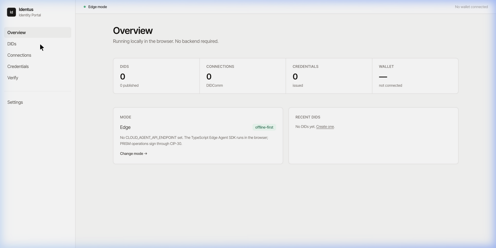
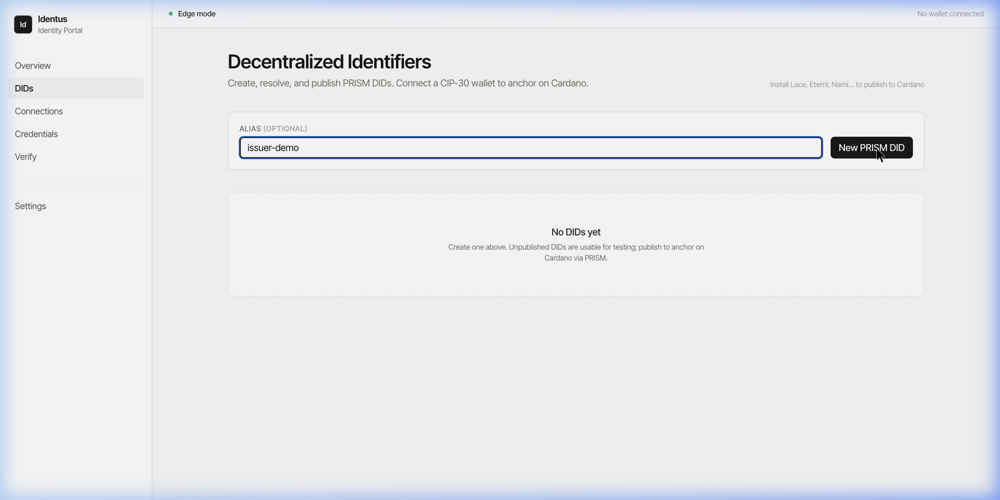
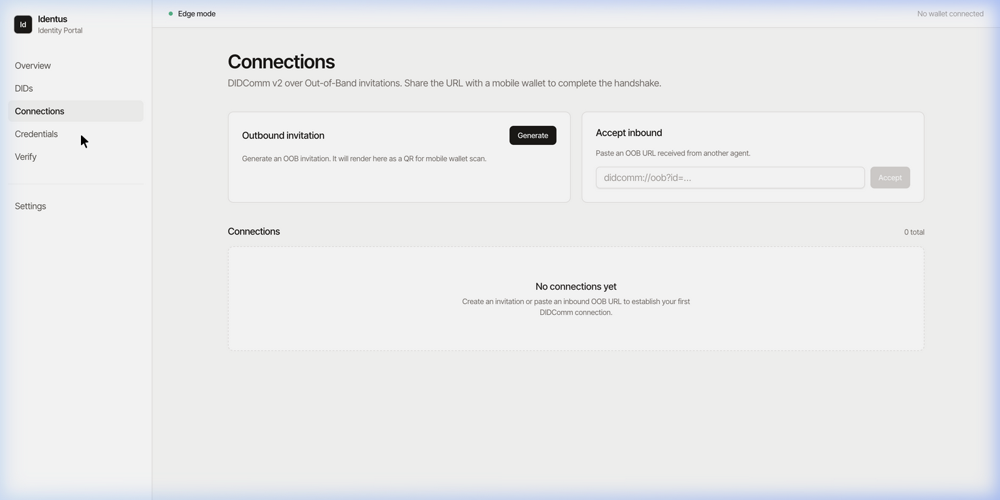
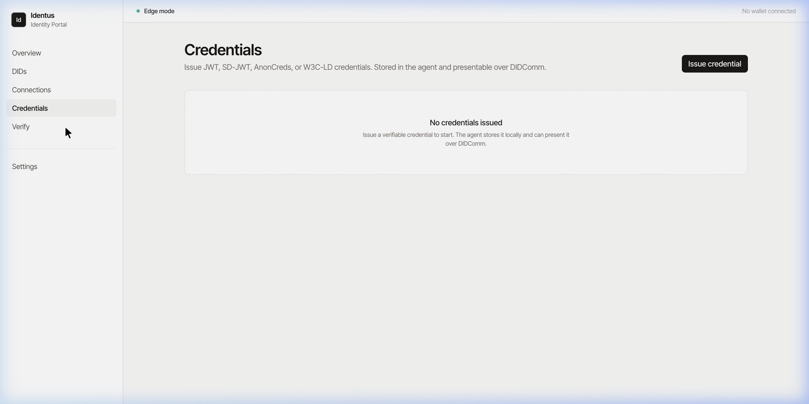
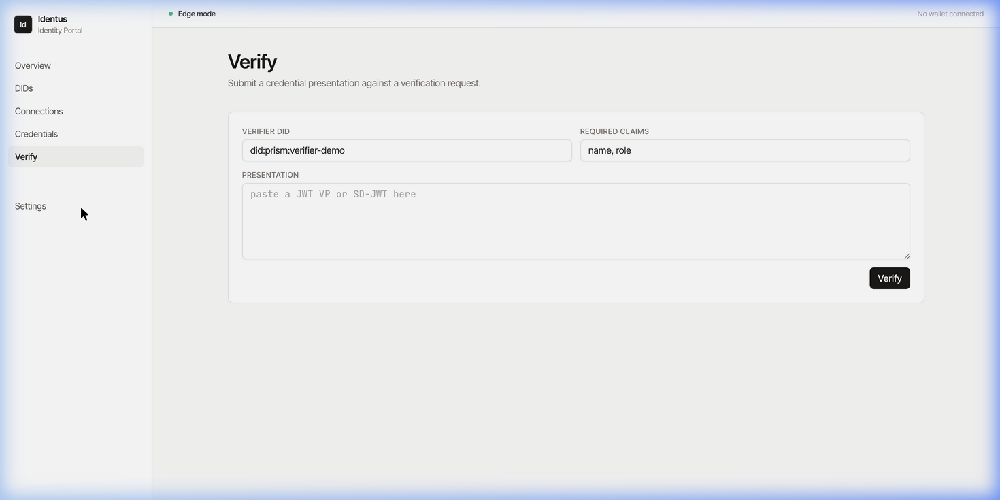
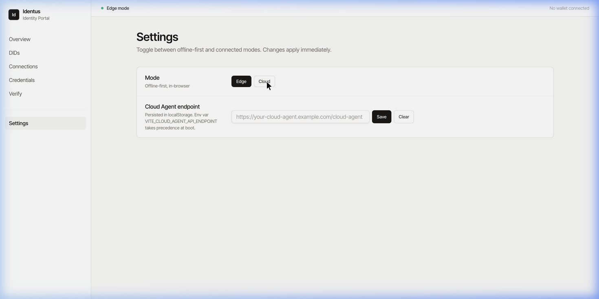

# Identus Identity Portal (POC)

A web dashboard for [Hyperledger Identus](https://github.com/hyperledger-identus) that drives both the browser-side **Edge Agent** (TypeScript SDK) and a connected **Cloud Agent** behind one interface. Built as a proof-of-concept for [LFDT mentorship #77](https://github.com/LF-Decentralized-Trust-Mentorships/mentorship-program/issues/77).

The portal works without any backend by default - the Edge Agent runs entirely in the browser and pairs with a CIP-30 Cardano wallet (MeshSDK) for PRISM operations. Set `VITE_CLOUD_AGENT_API_ENDPOINT` and the same UI talks to a Cloud Agent over REST instead. Switching modes is a one-click thing in Settings.

---

## Screenshots

### Overview Dashboard
The landing page shows real-time stats — DIDs created, active connections, issued credentials, and wallet status. The current agent mode (Edge/Cloud) is displayed with a quick-switch link.



### Decentralized Identifiers (DIDs)
Create PRISM DIDs with an optional alias. Each DID appears in a table with its status (`Draft` / `Published`), creation date, and action buttons to **Resolve** (fetch DID Document) or **Publish** (anchor on Cardano via CIP-30 wallet).



### Connections (DIDComm v2)
Bootstrap peer connections using **Out-of-Band invitations**. Generate an OOB URL (renders as a QR code for mobile wallet scanning) or accept an inbound invitation from another agent.



### Credentials
Issue JWT, SD-JWT, AnonCreds, or W3C-LD verifiable credentials. Credentials are stored in the agent and can be presented over DIDComm.



### Verification
Submit a credential presentation (JWT VP or SD-JWT) for verification. Specify the verifier DID and required claims — the agent checks the signature and temporal validity.



### Settings — Edge / Cloud Toggle
Switch between **Edge mode** (offline-first, browser-only, SDK runs in WASM) and **Cloud mode** (connected to a Cloud Agent REST API). The endpoint persists in `localStorage`.



---

## Layout

```
identus-portal/
├── app/                       Vite + React 18 portal
├── packages/
│   └── identus-portal-core/   framework-agnostic SSI contracts (pure TS)
└── repos/                     reference repos cloned for browsing
                                 ├── sdk-ts (@hyperledger/identus-sdk)
                                 └── cloud-agent (Scala backend)
```

The repo is an npm workspace. `app` consumes `@identus/portal-core` directly under that name - no `@core/*` path aliases, no implicit coupling. If you ever lift the core into its own repo, nothing in `app` has to change beyond the install.

## Running it

```sh
git clone https://github.com/abhigyan1102/Identus-Identity-Portal-PoC.git
cd Identus-Identity-Portal-PoC
npm install
npm run dev          # http://localhost:5173
```

To point at a real Cloud Agent:

```sh
echo 'VITE_CLOUD_AGENT_API_ENDPOINT=https://your-agent/cloud-agent' > app/.env
npm run dev
```

…or paste the endpoint into Settings inside the running app - it persists in `localStorage` and survives reloads.

## Architecture

### The Contract

The whole architecture is one file: [`packages/identus-portal-core/src/types/agent.ts`](packages/identus-portal-core/src/types/agent.ts). Read it first; everything else is structure around it.

```ts
export interface IAgent {
  readonly mode: 'edge' | 'cloud';
  start(): Promise<void>;
  createDID(opts?: CreateDIDOptions): Promise<DIDRecord>;
  resolveDID(did: string): Promise<DIDDocument>;
  publishDID(did: string): Promise<DIDRecord>;
  // …connections, credentials, verification
}
```

### Three-Layer Architecture

```
                            ┌────────────────────────────────┐
   UI                       │     React 18 + Tailwind        │
   (app/src/ui)             │     pages, components          │
                            └────────────────┬───────────────┘
                                             │ depends on IAgent only
                            ┌────────────────┴───────────────┐
   Adapters                 │  EdgeAgentAdapter              │
   (app/src/adapters)       │  CloudAgentAdapter             │
                            │  MeshCip30Wallet               │
                            └────────────────┬───────────────┘
                                             │ implements
                            ┌────────────────┴───────────────┐
   Core (pure TS)           │     IAgent, ICardanoWallet     │
   (packages/…-core)        │     domain types, utils        │
                            └────────────────────────────────┘
```

**Three rules govern this layout:**

1. **Core never imports UI or adapters.** It's plain TypeScript with no React, no SDK, no wallet libs.
2. **Adapters never import each other.** `EdgeAgentAdapter` and `CloudAgentAdapter` know nothing about each other.
3. **UI never branches on mode.** No `if (mode === 'cloud')` anywhere. The component calls `agent.X()` and that's it.

### Adapters

- [`EdgeAgentAdapter`](app/src/adapters/edge/EdgeAgentAdapter.ts) lazily imports `@hyperledger/identus-sdk` so the bundle still loads if the SDK's WASM init misbehaves in a particular browser. State is in-memory today; Pluto + IndexedDB is the next step.
- [`CloudAgentAdapter`](app/src/adapters/cloud/CloudAgentAdapter.ts) speaks the Cloud Agent REST API. It pings `_system/health` on `start()` and falls back to a local mock if the endpoint is unreachable, so the dashboard is always demoable from a laptop on a hotel Wi-Fi.

CIP-30 wallets sit behind a separate [`ICardanoWallet`](packages/identus-portal-core/src/types/wallet.ts) contract implemented by [`MeshCip30Wallet`](app/src/adapters/wallet/MeshCip30Wallet.ts). Replacing MeshSDK with another CIP-30 lib doesn't touch any UI code.

## What's stubbed and what's not

Honest status - more is stubbed than is real, and the design is the deliverable:

- Both adapters return believably-shaped data. Issuance, presentation verification, OOB connection state, and DID publish are backed by in-memory maps, not the real SDK calls.
- The Edge adapter's `start()` does pull `@hyperledger/identus-sdk` into the production bundle (~6 MB, mostly WASM crypto and DIDComm). The integration shape is what's being demonstrated; future iterations call into the SDK rather than re-plumbing the build.
- The CIP-30 wallet path is real: connecting a wallet, fetching the change address, and calling `signData` all work end-to-end. What that signature *means* for PRISM publishing is the open question below.

## Open design question - CIP-30 and PRISM publishing

The DIDs page demonstrates a CIP-30 `signData` round-trip when a wallet is connected, but it does not yet anchor a PRISM operation on Cardano. There's a key-hierarchy mismatch worth discussing before implementing.

`signData` produces a signature with the wallet's Cardano **payment** key. A PRISM `AtalaOperation` needs the DID's PRISM **master** key, which is a different hierarchy. So the wallet's role isn't really "sign the operation" - it's either "derive the PRISM key" or "fund and submit the tx that carries the operation in metadata." Two paths I see:

1. **One seed, two key trees.** Define a CIP-1854-style hardened derivation under a dedicated purpose so the same seed yields both Cardano payment keys and PRISM identity keys. One backup, one mental model - but it needs wallet support, either via a CIP or a helper extension.
2. **Independent PRISM keys, wallet only pays.** The agent holds PRISM keys via Pluto/Apollo. The connected wallet funds and submits the metadata-bearing transaction, nothing more. This mirrors how the Cloud Agent operates today and is a much smaller change.

I'd start with (2). It's the path of least surprise, gets a real publish working end-to-end, and leaves (1) as a follow-up that's interesting enough to be its own scope. Inline TODO at [`DIDsPage.tsx::onPublish`](app/src/ui/pages/DIDsPage.tsx).

## What's next

Roughly in order of value:

- Replace the Edge Agent's in-memory store with the SDK's Pluto + IndexedDB store. Start with `createDID` as proof-of-life rather than rewriting every method at once.
- Pick one of the two PRISM-publish paths above and wire it through Apollo + a Blockfrost/Koios submit call.
- Vitest contract suite that runs the same test file against both `EdgeAgentAdapter` and `CloudAgentAdapter`. The contract was designed for this; might as well prove it.
- Schemas page; mediator URL configuration; AnonCreds revocation list view.

## Stack

React 18.3 (pinned), Vite 5, TypeScript 5.6 strict. Tailwind for styling - no shadcn/ui or Radix, just a few hand-rolled components in [`app/src/ui/components`](app/src/ui/components). MeshSDK 1.9 for CIP-30, `qrcode.react` for OOB QR rendering, `vite-plugin-node-polyfills` so the SDK's Node-isms (`crypto`, `events`, `stream`) resolve in-browser.

React 18 over 19 is deliberate: matches the brief, and avoids dragging downstream consumers into the 19 transition before they're ready.

## Credits
- [Hyperledger Identus](https://github.com/hyperledger-identus) SDK & Cloud Agent
- [LFDT Mentorship #77](https://github.com/LF-Decentralized-Trust-Mentorships/mentorship-program/issues/77)